# 📋 Processo di Deploy Manuale - Elevenbase

## 🎯 Panoramica

Questo progetto utilizza un processo di deploy **completamente manuale** tramite Netlify CLI, senza GitHub Actions attive. Tutto il processo avviene localmente con build e deploy diretti su Netlify.

## 🔧 Configurazione Completata

✅ **Variabili di ambiente configurate** (`.env.production`)
✅ **Token Netlify e Site ID** disponibili in `netlify-setup.md`
✅ **Script helper** creati per semplificare il processo
✅ **Dipendenze installate** (`npm ci`)
✅ **Build testato** con successo

## 📦 Script Disponibili

### 1. **Deploy Preview (Draft)**
```bash
./deploy-preview.sh "Descrizione del cambiamento"
```
- Crea una build locale
- Deploy come **draft** (non in produzione)
- Genera un URL di preview per verifica
- Utile per testare modifiche prima della produzione

### 2. **Deploy Produzione**
```bash
./deploy-production.sh "Descrizione del rilascio"
```
- **ATTENZIONE**: Va direttamente in produzione!
- Verifica di essere su branch `main`
- Controlla che non ci siano modifiche non committate
- Deploy su https://elevenbase.pro

### 3. **Rollback**
```bash
./deploy-rollback.sh
```
- Mostra gli ultimi commit
- Permette di selezionare un commit precedente
- Crea un revert commit
- Rebuilda e deploya automaticamente

## 🚀 Processo Standard di Lavoro

### Per Sviluppo e Preview

1. **Crea un branch feature**
   ```bash
   git checkout -b feature/nome-feature
   ```

2. **Sviluppa e testa localmente**
   ```bash
   npm run dev
   ```

3. **Prima del push, allinea con main**
   ```bash
   git pull --rebase origin main
   ```

4. **Committa le modifiche**
   ```bash
   git add .
   git commit -m "feat: descrizione modifica"
   ```

5. **Deploy preview per verifica**
   ```bash
   ./deploy-preview.sh "Preview: nome feature"
   ```
   
6. **Condividi l'URL di preview** per approvazione

### Per Produzione

1. **Dopo approvazione, merge su main**
   ```bash
   git checkout main
   git merge feature/nome-feature
   git push origin main
   ```

2. **Deploy in produzione**
   ```bash
   ./deploy-production.sh "Release: nome feature"
   ```

## 📝 Comandi Rapidi

### Build Locale
```bash
npm run build
```
Output in `dist/`

### Deploy Preview Manuale (senza script)
```bash
npx netlify-cli@latest deploy \
  --auth "$(grep NETLIFY_AUTH_TOKEN= netlify-setup.md | cut -d= -f2)" \
  --site "$(grep NETLIFY_SITE_ID_PRODUCTION= netlify-setup.md | cut -d= -f2)" \
  --dir dist \
  --message "Preview deploy"
```

### Deploy Produzione Manuale (senza script)
```bash
npx netlify-cli@latest deploy \
  --auth "$(grep NETLIFY_AUTH_TOKEN= netlify-setup.md | cut -d= -f2)" \
  --site "$(grep NETLIFY_SITE_ID_PRODUCTION= netlify-setup.md | cut -d= -f2)" \
  --dir dist \
  --prod \
  --message "Production deploy"
```

## 🔍 Verifica Deploy

### URL Sito
- **Produzione**: https://elevenbase.pro
- **Netlify App**: https://ff2374c2-19b7-4a4e-86fa-fcd44ff751bd.netlify.app
- **Preview**: URL generato per ogni deploy preview

### Dashboard Netlify
- [Netlify Dashboard](https://app.netlify.com/sites/ff2374c2-19b7-4a4e-86fa-fcd44ff751bd)

## ⚠️ Note Importanti

1. **Nessun workflow GitHub attivo**: Tutto è manuale via CLI
2. **Build sempre locale**: Risparmia minuti di build Netlify
3. **Deploy non interattivi**: Usa token e site ID da file
4. **Messaggi espliciti**: Ogni deploy ha una descrizione
5. **File `.env.production`**: Creato automaticamente dagli script

## 🆘 Troubleshooting

### Errore: "Token Netlify mancante"
- Verifica che `netlify-setup.md` contenga le credenziali
- Token: `NETLIFY_AUTH_TOKEN=...`
- Site ID: `NETLIFY_SITE_ID_PRODUCTION=...`

### Errore durante il build
- Verifica le dipendenze: `npm ci`
- Controlla `.env.production`
- Pulisci cache: `rm -rf dist node_modules && npm ci`

### Deploy fallito
- Verifica connessione internet
- Controlla validità del token in `netlify-setup.md`
- Verifica che la cartella `dist/` esista dopo il build

## 📊 Log dei Deploy

I deploy in produzione vengono registrati automaticamente in `deploy-history.log` con:
- Data e ora
- Messaggio di deploy
- Hash del commit
- URL di produzione

## 🔄 Workflow Consigliato

```mermaid
graph LR
    A[Sviluppo locale] --> B[Build & Test]
    B --> C[Deploy Preview]
    C --> D{Approvato?}
    D -->|Sì| E[Merge su main]
    D -->|No| A
    E --> F[Deploy Produzione]
    F --> G[Verifica Live]
    G --> H{OK?}
    H -->|No| I[Rollback]
    H -->|Sì| J[✅ Completato]
```



## 🎉 Setup Completato!

L'ambiente è ora **completamente configurato** per:
- ✅ Build locali ottimizzati
- ✅ Deploy preview per test
- ✅ Deploy produzione controllati
- ✅ Rollback rapidi in caso di problemi
- ✅ Tracciamento completo dei deploy

Puoi iniziare a lavorare usando gli script helper o i comandi manuali documentati sopra.