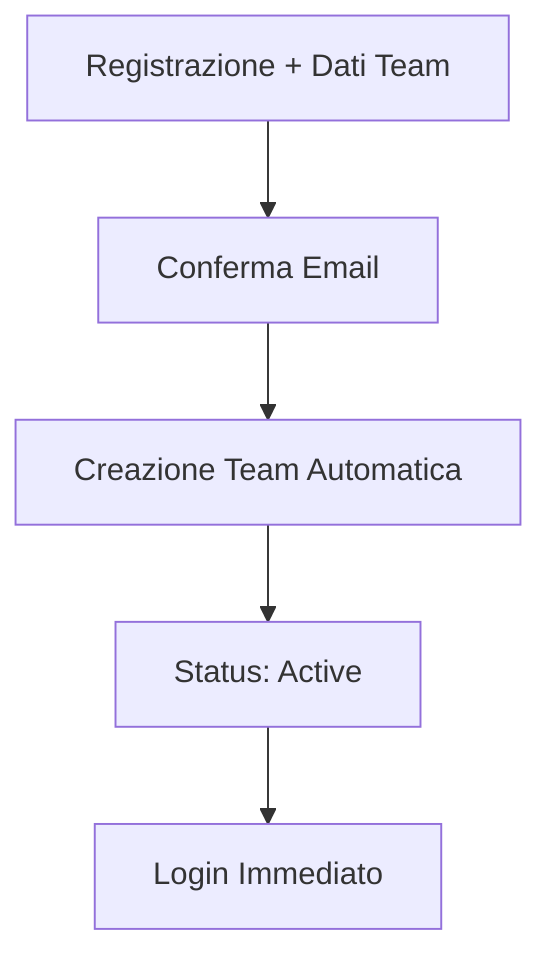
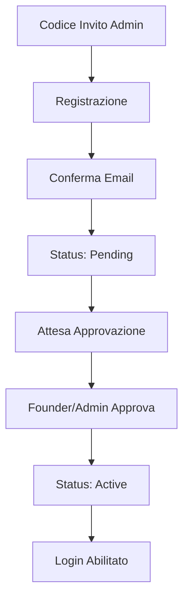
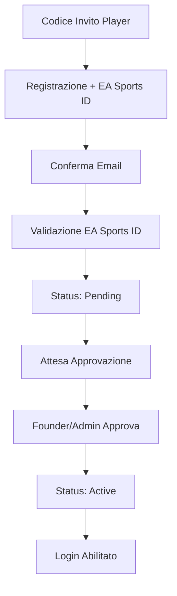

# 🎯 **NUOVO SISTEMA REGISTRAZIONE - DOCUMENTAZIONE COMPLETA**

## 📋 **PANORAMICA**

Il sistema di registrazione è stato completamente ridisegnato per supportare 3 tipologie di utenti con flussi di registrazione specifici:

- **👑 Founder**: Creatori di team (auto-attivati)
- **🛡️ Admin**: Gestori invitati (richiedono approvazione)  
- **⚽ Player**: Giocatori invitati (richiedono approvazione + EA Sports ID)

---

## 🏗️ **ARCHITETTURA DATABASE**

### **📊 Schema Tabelle Principali**

```sql
-- Ruoli globali (solo superadmin)
user_roles {
  user_id: UUID → auth.users(id)
  role: TEXT CHECK (role = 'superadmin')
}

-- Membership team-based
team_members {
  user_id: UUID → auth.users(id)
  team_id: UUID → teams(id)
  role: TEXT CHECK (role IN ('founder', 'admin', 'player'))
  status: TEXT CHECK (status IN ('pending', 'active', 'suspended'))
  ea_sports_id: TEXT (obbligatorio per player)
  invited_by: UUID → auth.users(id)
  approved_by: UUID → auth.users(id)
  approved_at: TIMESTAMPTZ
}

-- Inviti team
team_invites {
  team_id: UUID → teams(id)
  code: TEXT UNIQUE
  role: TEXT CHECK (role IN ('admin', 'player'))
  expires_at: TIMESTAMPTZ
  max_uses: INTEGER
  used_count: INTEGER
}
```

### **🔑 Funzioni di Controllo Accesso**

```sql
-- Superadmin globale
is_superadmin(_user_id) → BOOLEAN

-- Founder del team
is_team_founder(_team_id, _user_id) → BOOLEAN

-- Gestione team (founder + admin)
can_manage_team(_team_id, _user_id) → BOOLEAN

-- Visualizzazione team (tutti i membri attivi)
can_view_team(_team_id, _user_id) → BOOLEAN
```

---

## 🚀 **FLUSSI DI REGISTRAZIONE**

### **1️⃣ FLUSSO FOUNDER**



**🔧 Implementazione:**
- **Frontend**: `RegisterFounder.tsx`
- **Backend**: `register_founder_with_team()`
- **Caratteristiche**:
  - ✅ Auto-attivato
  - 👑 Diventa owner del team
  - 🚀 Login immediato post-conferma

### **2️⃣ FLUSSO ADMIN (Invitato)**



**🔧 Implementazione:**
- **Frontend**: `RegisterInvite.tsx` 
- **Backend**: `register_with_invite_code()`
- **Caratteristiche**:
  - 🎫 Codice invito specifico
  - ⏳ Status pending
  - 👑 Richiede approvazione

### **3️⃣ FLUSSO PLAYER (Invitato)**



**🔧 Implementazione:**
- **Frontend**: `RegisterInvite.tsx`
- **Backend**: `register_with_invite_code()`
- **Caratteristiche**:
  - 🎫 Codice invito specifico
  - 🎮 **EA Sports ID obbligatorio**
  - ⏳ Status pending
  - 👑 Richiede approvazione

---

## 💻 **COMPONENTI FRONTEND**

### **📱 Pagine Principali**

| Componente | Scopo | Utenti Target |
|------------|-------|---------------|
| `RegisterFounder.tsx` | Registrazione founder + creazione team | Creatori team |
| `RegisterInvite.tsx` | Registrazione con codice invito | Admin & Player |
| `EmailConfirm.tsx` | Conferma email per tutti i flussi | Tutti |
| `PendingApprovals.tsx` | Gestione approvazioni | Founder & Admin |

### **🔐 Sistema Autenticazione**

- **`AuthContext.tsx`**: Gestione sessione + registration status
- **`AdminRoute.tsx`**: Protezione route per admin/founder
- **`ProtectedRoute.tsx`**: Protezione base per utenti autenticati

### **🎯 Caratteristiche Principali**

- ✅ **Validazione real-time** codici invito
- ✅ **EA Sports ID validation** per player
- ✅ **Status tracking** completo
- ✅ **UI responsive** e moderna
- ✅ **Toast notifications** per feedback

---

## 🛡️ **SISTEMA APPROVAZIONI**

### **📋 Dashboard Approvazioni**

**Accesso**: Solo Founder e Admin attivi
**Funzionalità**:
- 📊 Vista pending members
- ✅ Approvazione con note
- ❌ Rifiuto con motivo
- 📧 Dettagli completi utente

### **🔧 Funzioni Backend**

```sql
-- Lista membri in attesa
get_pending_approvals(_team_id) → TABLE

-- Approvazione membro
approve_team_member(_member_id, _notes) → JSON

-- Rifiuto membro  
reject_team_member(_member_id, _reason) → JSON
```

---

## 🎮 **GESTIONE EA SPORTS ID**

### **📝 Requisiti**

- **Obbligatorio**: Solo per ruolo `player`
- **Unicità**: Per team (stesso ID non può essere usato da 2 player dello stesso team)
- **Validazione**: Formato e disponibilità
- **Immutabilità**: Non modificabile post-registrazione

### **🔧 Validazione**

```sql
validate_ea_sports_id(_ea_sports_id, _team_id) → JSON {
  "valid": boolean,
  "error": string | null
}
```

**Controlli Effettuati**:
- ✅ Lunghezza (3-50 caratteri)
- ✅ Non vuoto
- ✅ Unicità nel team

---

## 🔄 **TRASFERIMENTO OWNERSHIP**

### **👑 Caratteristiche**

- **Solo owner corrente** può trasferire
- **Target**: Deve essere membro attivo del team
- **Tracking**: Storico trasferimenti in `team_ownership_transfers`
- **Atomico**: Operazione transazionale completa

### **🔧 Implementazione**

```sql
transfer_team_ownership(
  _team_id UUID,
  _new_founder_user_id UUID, 
  _reason TEXT
) → BOOLEAN
```

**Operazioni Effettuate**:
1. 👑 Founder attuale → Admin
2. 🎯 Nuovo target → Founder  
3. 🔄 Update `teams.owner_id`
4. 📝 Log trasferimento

---

## 🔐 **SISTEMA PERMESSI**

### **📊 Matrice Permessi**

| Ruolo | Gestione Team | Approvazioni | Visualizzazione | Note |
|-------|---------------|--------------|-----------------|------|
| **Superadmin** | ✅ Tutti | ✅ Tutti | ✅ Tutto | Accesso globale |
| **Founder** | ✅ Proprio team | ✅ Proprio team | ✅ Proprio team | Owner del team |
| **Admin** | ✅ Proprio team | ✅ Proprio team | ✅ Proprio team | Gestione delegata |
| **Player** | ❌ | ❌ | ✅ Proprio team | Solo visualizzazione |

### **🛡️ Row Level Security**

Tutte le tabelle hanno RLS abilitato con policies specifiche:
- **`user_roles`**: Solo superadmin
- **`team_members`**: Basato su membership e ruolo  
- **`team_invites`**: Gestori del team
- **`teams`**: Owner e membri

---

## 🚨 **GESTIONE ERRORI**

### **📋 Errori Comuni e Soluzioni**

| Errore | Causa | Soluzione |
|--------|-------|-----------|
| "Non appartieni a nessuna squadra" | Utente senza team | Completare registrazione |
| "Account in attesa di approvazione" | Status pending | Attendere approvazione admin |
| "Codice invito non valido" | Codice sbagliato/scaduto | Richiedere nuovo codice |
| "EA Sports ID già utilizzato" | ID duplicato nel team | Usare ID diverso |
| "Email non confermata" | Conferma email mancante | Controllare inbox email |

### **🔧 Debug e Monitoring**

- **Logs**: Tutti i trigger hanno RAISE NOTICE
- **Validazioni**: Controlli pre-insert/update
- **Transactions**: Operazioni atomiche
- **Fallback**: Gestione graceful degli errori

---

## 🎯 **CONFIGURAZIONE DEPLOYMENT**

### **📂 File da Eseguire in Ordine**

1. **`reset_registration_system_complete.sql`**
   - Reset completo sistema esistente
   - Creazione nuovo schema
   - Setup funzioni base

2. **`registration_system_functions.sql`**
   - Funzioni avanzate registrazione
   - Sistema approvazioni  
   - Validazioni

3. **Test (opzionale)**: `test_new_registration_system.sql`

### **⚙️ Configurazioni Richieste**

- **Superadmin Email**: `coach@elevenbase.pro` (auto-configurato)
- **Email Templates**: Configurare in Supabase Dashboard
- **CORS**: Aggiungere domini per email redirect
- **Storage**: Bucket per avatar/loghi (se necessario)

---

## ✅ **CHECKLIST PRE-PRODUZIONE**

### **🔧 Database**
- [ ] Eseguire reset script
- [ ] Verificare funzioni create
- [ ] Test con dati reali
- [ ] Backup dati esistenti

### **💻 Frontend**  
- [ ] Aggiornare routes per nuove pagine
- [ ] Test registrazione completa
- [ ] Verificare email redirect URLs
- [ ] Test responsive design

### **📧 Email**
- [ ] Template conferma email
- [ ] Redirect URLs corretti
- [ ] Test invio email

### **🛡️ Sicurezza**
- [ ] Verificare RLS policies
- [ ] Test permessi ruoli
- [ ] Validazione input frontend
- [ ] Rate limiting registrazioni

---

## 🚀 **VANTAGGI DEL NUOVO SISTEMA**

### **✨ Miglioramenti Chiave**

1. **🎯 Flussi Specifici**: Ogni tipo utente ha il suo percorso ottimizzato
2. **🔐 Sicurezza Avanzata**: RLS granulare e controlli specifici
3. **⚡ Performance**: Funzioni ottimizzate e indici appropriati
4. **📱 UX Migliorata**: UI moderna e feedback real-time
5. **🧹 Codice Pulito**: Architettura semplificata e manutenibile
6. **🎮 EA Sports Integration**: Gestione nativa ID gaming
7. **👑 Ownership Transfer**: Sistema completo trasferimento controllo
8. **📊 Monitoring**: Tracking completo operazioni e errori

### **🔄 Backward Compatibility**

- ✅ Mantenimento `localStorage` keys esistenti
- ✅ Funzioni helper legacy supportate  
- ✅ Migration path per dati esistenti
- ✅ Gradual rollout possibile

---

## 📞 **SUPPORTO E TROUBLESHOOTING**

### **🐛 Debug Common Issues**

```sql
-- Verifica status utente
SELECT get_user_registration_status('user-uuid-here');

-- Lista pending approvals
SELECT * FROM get_pending_approvals('team-uuid-here');

-- Stato team completo
SELECT t.*, tm.* FROM teams t 
JOIN team_members tm ON tm.team_id = t.id 
WHERE t.id = 'team-uuid-here';
```

### **🛠️ Reset Parziale (se necessario)**

```sql
-- Reset solo approvazioni
UPDATE team_members SET status = 'pending' 
WHERE status = 'active' AND role IN ('admin', 'player');

-- Reset inviti
UPDATE team_invites SET used_count = 0, is_active = true;
```

---

**🎉 Sistema pronto per la produzione!** Il nuovo sistema di registrazione offre un'esperienza utente ottimale, sicurezza avanzata e flessibilità per la crescita futura della piattaforma.